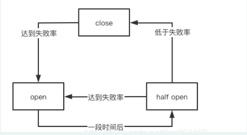
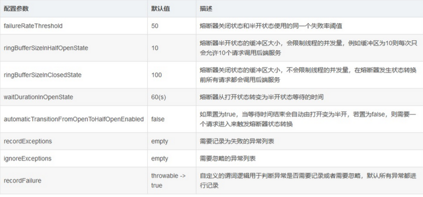

### Circuitbreaker短路器

> 通过一个时间或数量窗口来记录当前的请求成功率或慢速率，从而根据这些指标来作出正确的容错响应。


#### 短路模式的技术实现类型

CircuitBreaker目前支持两种方式调用，一种是程序式调用，一种是AOP使用注解的方式调用。


#### 断路器的状态转换

通常存在三种状态（CLOSE、OPEN、HALF_OPEN）




#### 断路器的参数信息配置




#### maven配置分析

```xml

<dependency>
    <groupId>io.github.resilience4j</groupId>
    <artifactId>resilience4j-circuitbreaker</artifactId>
    <version>${resilience4j.version}</version>
</dependency>

```

#### springboot的配置介绍


##### yml文件配置


```yaml

resilience4j:
  circuitbreaker:
    configs:
      default:
        ringBufferSizeInClosedState: 5 # 熔断器关闭时的缓冲区大小
        ringBufferSizeInHalfOpenState: 2 # 熔断器半开时的缓冲区大小
        waitDurationInOpenState: 10000 # 熔断器从打开到半开需要的时间
        failureRateThreshold: 60 # 熔断器打开的失败阈值
        eventConsumerBufferSize: 10 # 事件缓冲区大小
        registerHealthIndicator: true # 健康监测
        automaticTransitionFromOpenToHalfOpenEnabled: false # 是否自动从打开到半开，不需要触发
        recordFailurePredicate:    com.example.resilience4j.exceptions.RecordFailurePredicate # 谓词设置异常是否为失败
        recordExceptions: # 记录的异常
          - com.example.resilience4j.exceptions.BusinessBException
          - com.example.resilience4j.exceptions.BusinessAException
        ignoreExceptions: # 忽略的异常
          - com.example.resilience4j.exceptions.BusinessAException
    instances:
      backendA:
        baseConfig: default
        waitDurationInOpenState: 5000
        failureRateThreshold: 20
      backendB:
        baseConfig: default

```

- resilience4j: 代表着resilience4j的配置
  - circuitbreaker：代表着circuitbreaker的断路器功能的配置
   - configs: 代表着配置信息
    - default：全局默认配置
   - instances: 代表这实例信息
    - backendA/backendB：代表着不同的资源名称，可以用于指定方法或者类

#### AOP开发使用

> @CircuitBreaker(name="",fallbackMethod="")注解，其中name是要使用的熔断器的名称，fallbackMethod是要使用的降级方法，降级方法必须和原方法放在同一个类中，且降级方法的返回值需要和原方法相同，输入参数需要添加额外的exception参数


```java

public CircuitBreakerService{

    @CircuitBreaker(name = "backendA", fallbackMethod = "fallBack")
    public void process() throws TimeoutException, InterruptedException {
        ... ...
    }

    private void fallBack(Throwable throwable){
        log.info(throwable.getLocalizedMessage() + ",方法被降级了~~");
        ... ...
    }
    
    private void fallBack(CallNotPermittedException e){
        log.info("熔断器已经打开，拒绝访问被保护方法~");
    }

}

```


> 可使用多个降级方法，保持方法名相同，同时满足的条件的降级方法会触发最接近的一个（这里的接近是指类型的接近，先会触发离它最近的子类异常


#### 异常的控制和黑白名单

```yaml
recordExceptions: # 记录的异常
- com.example.resilience4j.exceptions.BusinessBException
- com.example.resilience4j.exceptions.BusinessAException
ignoreExceptions: # 忽略的异常
- com.example.resilience4j.exceptions.BusinessAException
```