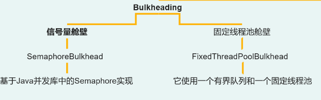
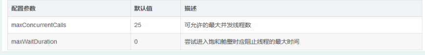

### Bulk-Heading舱壁器

> Resilence4j的Bulkhead提供两种实现，一种是基于信号量的，另一种是基于有等待队列的固定大小的线程池的，由于基于信号量的Bulkhead能很好地在多线程和I/O模型下工作，所以选择介绍基于信号量的Bulkhead的使用。


#### 舱壁模式的技术实现类型



#### 舱壁模式的技术配置参数




#### maven配置分析

```xml

<dependency>
    <groupId>io.github.resilience4j</groupId>
    <artifactId>resilience4j-bulkhead</artifactId>
    <version>${resilience4j.version}</version>
</dependency>

```

#### springboot的配置介绍


##### yml文件配置


```yaml

resilience4j:
  bulkhead:
    configs:
      default:
        maxConcurrentCalls: 10
        maxWaitDuration: 1000
    instances:
      backendA:
        baseConfig: default
        maxConcurrentCalls: 3
      backendB:
        baseConfig: default
        maxWaitDuration: 100

```

- resilience4j: 代表着resilience4j的配置
  - bulkhead：代表着bulkhead的舱壁功能的配置
   - configs: 代表着配置信息
    - default：全局默认配置
   - instances: 代表这实例信息
    - backendA/backendB：代表着不同的资源名称，可以用于指定方法或者类

#### AOP开发使用

> @Bulkhead(name="", fallbackMethod="", type="")注解，其中name是要使用的Bulkhead实例的名称，fallbackMethod是要使用的降级方法，type是选择信号量或线程池的Bulkhead：


```java

public class BulkHeadingService{

@Bulkhead(name = "backendA", fallbackMethod = "fallback", type = Bulkhead.Type.SEMAPHORE)
    public void process() throws TimeoutException, InterruptedException {
    }

    private void fallback(BulkheadFullException e){
        log.info("服务失败: " + e.getLocalizedMessage());
    }
} 

```
