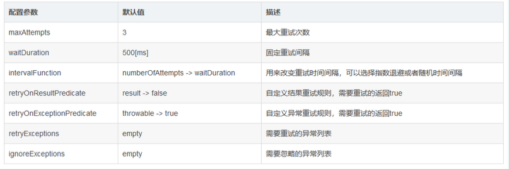

### Retry重试器


> 当服务端处理客户端请求异常时，服务端将会开启重试机制，重试期间内，服务端将每隔一段时间重试业务逻辑处理。 

#### 重试模式的技术实现方式

1. 如果最大重试次数内成功处理业务，则停止重试，视为处理成功

2. 如果在最大重试次数内处理业务逻辑依然异常，则系统将拒绝该请求


#### 重试模式的技术配置参数




#### maven配置分析

```xml

 <dependency>
      <groupId>io.github.resilience4j</groupId>
      <artifactId>resilience4j-retry</artifactId>
      <version>${resilience4j.version}</version>
</dependency>

```

#### springboot的配置介绍


##### yml文件配置


```yaml

resilience4j:
  retry:
    configs:
      default:
        maxRetryAttempts: 3
        waitDuration: 10s
        enableExponentialBackoff: true    # 是否允许使用指数退避算法进行重试间隔时间的计算
        expontialBackoffMultiplier: 2     # 指数退避算法的乘数
        enableRandomizedWait: false       # 是否允许使用随机的重试间隔
        randomizedWaitFactor: 0.5         # 随机因子
        resultPredicate: com.example.resilience4j.predicate.RetryOnResultPredicate    
        retryExceptionPredicate: com.example.resilience4j.predicate.RetryOnExceptionPredicate
        retryExceptions:
            - com.example.resilience4j.exceptions.BusinessBException
            - com.example.resilience4j.exceptions.BusinessAException
            - io.github.resilience4j.circuitbreaker.CallNotPermittedException
        ignoreExceptions:
            - io.github.resilience4j.circuitbreaker.CallNotPermittedException
    instances:
      backendA:
        baseConfig: default
        waitDuration: 5s
      backendB:
        baseConfig: default
        maxRetryAttempts: 2   

```

- resilience4j: 代表着resilience4j的配置
  - retry：代表着retry的重试功能的配置
   - configs: 代表着配置信息
    - default：全局默认配置
   - instances: 代表这实例信息
    - backendA/backendB：代表着不同的资源名称，可以用于指定方法或者类

#### AOP开发使用

> @Retry(name="",fallbackMethod="")注解，其中name是要使用的重试器实例的名称，fallbackMethod是要使用的降级方法：


```java

public class RetryProcess{

    @Retry(name = "backendA", fallbackMethod = "fallBack")
    public void process() throws TimeoutException, InterruptedException {
        ... ...
    }
    private void fallback(BulkheadFullException e){
        log.info("服务失败: " + e.getLocalizedMessage());
    }
} 

```

> application.yml可以配置的参数多出了几个enableExponentialBackoff、expontialBackoffMultiplier、enableRandomizedWait、randomizedWaitFactor，分别代表是否允许指数退避间隔时间，指数退避的乘数、是否允许随机间隔时间、随机因子，注意指数退避和随机间隔不能同时启用。
