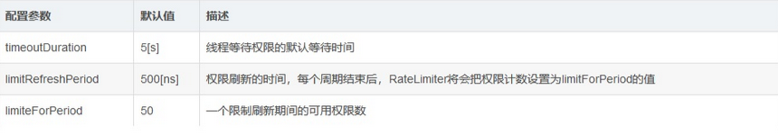

### RateLimiter限流器

> 高频控制是可以限制服务调用频率，Resilience4j的RateLimiter可以对频率进行纳秒级别的控制，在每一个周期刷新可以调用的次数，还可以设定线程等待权限的时间。

#### 限流器的技术配置参数




#### maven配置分析

```xml

<dependency>
    <groupId>io.github.resilience4j</groupId>
    <artifactId>resilience4j-ratelimiter</artifactId>
    <version>${resilience4j.version}</version>
</dependency>

```

#### springboot的配置介绍


##### yml文件配置


```yaml

resilience4j:
 ratelimiter:
    configs:
     default:
      limitForPeriod: 5
      limitRefreshPeriod: 1s
      timeoutDuration: 5s
    instances:
      backendA:
        baseConfig: default
        limitForPeriod: 1
      backendB:
        baseConfig: default
        timeoutDuration: 0s
```


- resilience4j: 代表着resilience4j的配置
  - ratelimiter：代表着ratelimiter的功能的配置
   - configs: 代表着配置信息
    - default：全局默认配置
   - instances: 代表这实例信息
    - backendA/backendB：代表着不同的资源名称，可以用于指定方法或者类


#### AOP开发使用

> 首先在连接器方法上使用@RateLimiter(name="", fallbackMethod="")注解，其中name是要使用的RateLimiter实例的名称，fallbackMethod是要使用的降级方法：


##### RateLimiter搭配着熔断器处理


```java

public RateLimiterHandler{

    @RateLimiter(name = "test1", fallbackMethod = "fallback")
    public void process() throws TimeoutException, InterruptedException {
        ... ...
    }

    private void fallback(BulkheadFullException e){
        log.info("服务失败: " + e.getLocalizedMessage());
        ... ...
    }
} 

```
