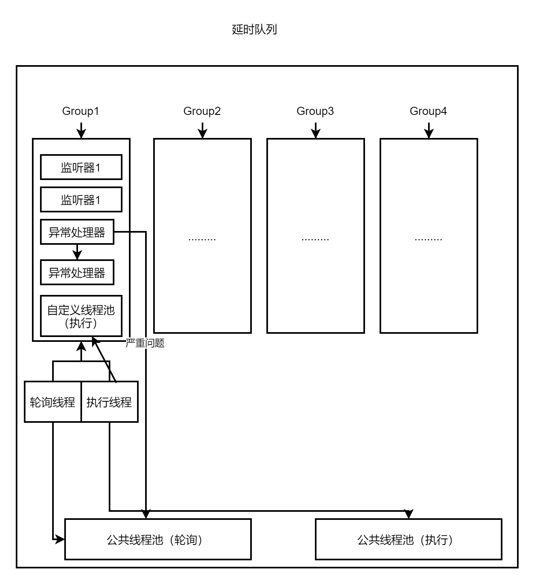
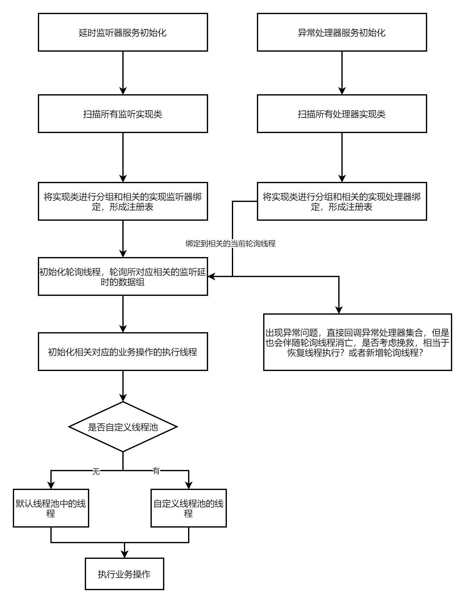
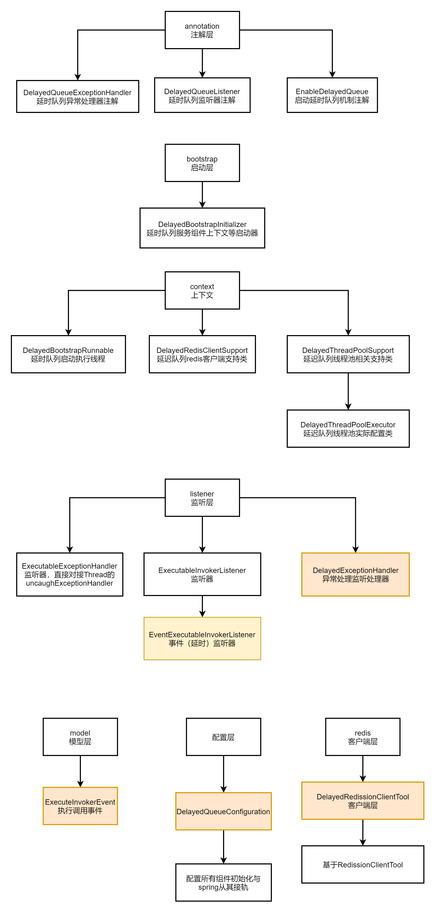
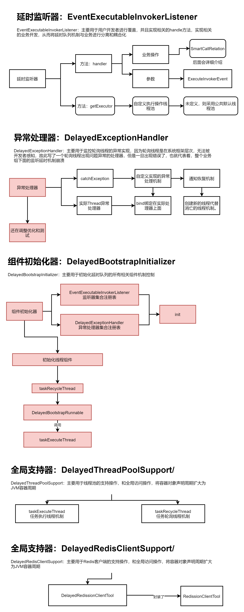

### 版本对比

- 延时队列V1.0 -> framework 1.0.7版本

### 前提介绍

> **针对于目前，系统中的延时队列的开发复杂度以及统一化管理没有完成相关的标准，故此本人封装了一款，基于Redssion的框架为基础的也是基于我们现在framework为基础的延时队列框架开发机制组件，方便未来大家去开发属于自己的延时队列的开发规范以及开发成本！**


### 解决痛点

- 基于原始的redis失效的EntryExpiredListener的定时监听器，因为考虑周期性和性能和延迟问题过大，所以有了本次版本组件封装的优化

- 简化开发，系统多出使用原生的redission客户端，因为这无形中给开发人员带来了很大的工作量，考虑未来的开发过程中会存在很多延时队列的场景

- 无标准，使用的延时开发实现原理的种类非常的多，有内存机制的延时队列、消息队列的延时实现、redis的延时队列，为了达成标准化。

- 统一化管理，防止问题重复出现或者多点问题出现机制。


### 延时队列组件的组件架构

- 延时队列采用redis 大key或者业务组、业务类型进行划分出不同的分割领域，每个组都是属于相互隔离。

- 自己消费自己的数据信息以及异常处理和轮询和执行机制



### 延时队列组件的初始化流程

- 主要针对于轮询线程、执行线程的初始化

- 主要针对于注册监听器、异常处理器机制



### 延时队列组件的整体核心类架构




### 延时队列组件的整体核心类功能介绍




### 延时队列的开发组件包 

#### 项目位置 ： assemble-platform-taskQueue

#### 项目版本 ： 1.0.0

#####  包位置：com.xxx

##### 核心类介绍：

###### 包：com.xxx.annotation

- com.xxx.annotation.DelayedQueueExceptionHandler

    - 主要统一化相关的异常处理机制，因为系统对与监控线程执行的异常处理，略微薄弱，故此异常处理的注解进行定义和声明相关的异常处理器类

    - 服务类注解和修饰的实现类，均有spring容器进行管理。

    - 延时队列的划分和隔离可以采用group组的方式及进行划分，通过业务定义一个group复用一个线程，进行轮询，此外还可以自定义话自己执行的线程池

- com.xxx.annotation.DelayedQueueListener

    -  定义延时队列的监听器机制，用于分为不同的组件

    -  有相关group分组的属性 ： 用于分组
    
    - 有相关的监听器类唯一标识value：用于唯一标识

- com.xxx.annotation.EnableDelayedQueue
    
    - 主要用于启动导入EnableAutoConfiguration级别的注解：DelayedQueueConfiguration
    
    - 加载系统所有的组件信息：

        - DelayedRedissionClientTool：封装了相关的RedissionClientTool工具组件机制    
 
        - delayedExecuteThreadPoolExecutor：执行线程池（公共默认）

        - delayedExecuteThreadPoolCycle：轮询线程池

        - DelayedBootstrapInitializer：初始化核心容器组件加载器

###### 包：com.xxx.context

- com.xxx.context.DelayedBootstrapRunnable

    1. 轮询执行线程执行类

    2. 包含了内部执行线程

    3. 提取延时队列里的数据信息

    4. 传递给下游的监听器集合执行

- com.xxx.context.DelayedRedisClientSupport

    - DelayedRedissionClientTool 包装了初始化DelayedRedissionClientTool机制

    - 全局扩大了声明周期 到 jvm层级 

- com.xxx.context.DelayedThreadPoolExecutor

    - 初始化核心配置针对于不同的分组建立线程池ThreadPoolTaskExecutor
    ```
        executor.setCorePoolSize(DEFAULT_THREAD_CORE_SIZE_IO_TYPE);
        executor.setMaxPoolSize(DEFAULT_THREAD_CORE_SIZE_IO_TYPE << DEFAULT_THREAD_CORE_BASE_SIZE);
        executor.setQueueCapacity(1000);
        executor.setKeepAliveSeconds(30);
        executor.setThreadGroupName(threadGroup);
    ```

- com.xxx.context.DelayedThreadPoolSupport

    -  Executor taskExecuteThread：执行线程池
    -  Executor taskRecycleThread;：轮询线程池

###### 包：com.xxx.bootstrap

- com.xxx.bootstrap.DelayedBootstrapInitializer
    
    - 开始初始化加载完成系统内部所有的相关的延迟队列监听上下文接口服务数据
    - 开始开展完成线程任务分配为每个分组的监听器以及任务队列分配资源
    - 开始生产相关的监听绑定关系机制
    - 开始初始化相关的异常信息处理机制
    - 初始化线程机制

###### 包：com.xxx.impl

- com.xxx.impl.EventExecutableInvokerListener

    - 执行监听器

###### 包：com.xxx.listener

- com.xxx.listener.DelayedExceptionHandler

    - 异常处理器

- com.xxx.listener.ExecutableExceptionHandler

    - 异常处理器集合

- com.xxx.listener.ExecutableInvokerListener

###### 包：com.xxx.model

- com.xxx.model.ExecuteInvokerEvent

###### 包：com.xxx.redis

com.xxx.redis.DelayedRedissionClientTool

----------

com.xxx.DelayedQueueConfiguration

- 延迟队列总体配置类

### 延时队列的使用案例

#### 延时队列投递数据方：

```java

@Autowired(required = false)
public DelayedRedissionClientTool delayedRedissionClientTool;
public void testProducerElement(){
        AtomicInteger atomicInteger = new AtomicInteger();
        IntStream.range(0,200).forEach(param->{
            log.info("开始投递数据信息");
             // 业务编号必须传入，为了去重；此外分组必须穿，如同mq的topic
            ExecuteInvokerEvent executeInvokerEvent = new ExecuteInvokerEvent(String.valueOf(atomicInteger.incrementAndGet()),"TEST_GROUP");
            executeInvokerEvent2.setDelayedTime(10L); // 延时时长度
            executeInvokerEvent2.setDataModel("asdasda"); //传输数据模型。泛型类型
            executeInvokerEvent2.setTimeUnit(TimeUnit.SECONDS); // 延时时间单位
            delayedRedissionClientTool.offer(executeInvokerEvent); //数据存储
        });
    }
```

#### 延时队列消费数据方：
```java
@Slf4j
@DelayedQueueListener(value="delayedQueueTest",group="TEST_GROUP")
public class DelayedQueueTest implements EventExecutableInvokerListener<ExecuteInvokerEvent<Object>,Object> {
    /**
     * 可以自定义线程池，但是一个组中，只会采用其中一个线程池去执行，防止过多使用资源
     * @return
     */
    @Override
    public Executor getExecutor() {
        return null;
    }
    /**
     * 任务执行机制控制服务
     * @param param 返回值为以后callable使用
     * @return
     */
    @Override
    public Object handle(ExecuteInvokerEvent<ExecuteInvokerEvent<Object>> param) {
        try {
            System.out.println(MessageFormat.format("【1】执行解析完成调用:应该执行时间：{0,date,yyyy-MM-dd HH:mm:ss}，" +
                    "实际执行时间：{1,date,yyyy-MM-dd HH:mm:ss},创建时间：{2,date,yyyy-MM-dd HH:mm:ss}",param.getFiredTime(), new Date(),new Date(param.getCreateTime())));
        } catch (Exception e) {
            e.printStackTrace();
        }
        return null;
    }
}
```

#### 延时轮询线程异常处理器：

```java
 */
@DelayedQueueExceptionHandler(value="delayedHandler",group="TEST_GROUP")
public class DelayedTestQueueExceptionHandler implements DelayedExceptionHandler {
    @Override
    public void catchException(Throwable e, Thread currentThread) {
        System.out.println("asdasdasda---------------------");
//        e.printStackTrace();
    }
}
```
### 问题反馈

1. 大家是不是觉得非常便利开发相关的延迟队列？
2. 异常处理机制待优化
3. 性能提升带优化
4. 循环线程属于非常痛点和薄弱的问题


