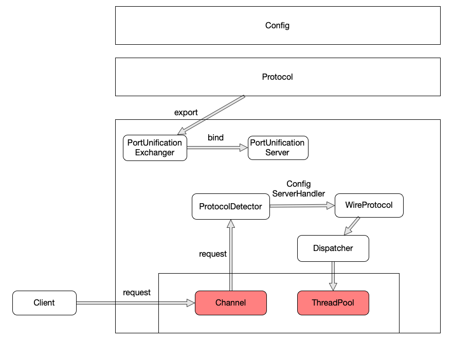

# 目标

1. 保证原有的扩展性
2. 最小改动和侵入性来支持端口复用

# 问题

- 原有的分端口暴露协议的能力是否还需要保留？场景和影响？
- 启用端口复用后，暴露所有协议还是按需暴露？
  - 按需暴露：需要用户感知暴露的协议，比如配置protocol="dubbo,tri"
  - 暴露所有协议：用户不再感知暴露的协议，是否会造成一些安全性等问题？在做服务注册的时候也会注册所有协议的服务。
- 如果选择按需暴露，在多协议暴露的情况下，端口复用需要选择哪个端口作为复用的端口？
- 端口复用了，那么channel、连接数等配置是否复用，还是累加，或者增加别的配置方式和计算方式。

# 配置方案

（一）原有的协议保留，在Triple协议的端口上陆续集成不同的协议。在未来某一个版本之后，去掉不同端口的实现：

因为Dubbo3 的主推协议是Triple，所以我们将会在Triple上做端口复用，即只要配置了Triple协议，就可以采用端口复用的能力。

第一种：举个例子，拿xml接入方式为例，以往我们配置多协议的方式是

```xml
<dubbo:protocol name="dubbo" port="20880"/>
<dubbo:protocol name="tri" port="50051"/>
<bean id="tripleService" class="org.apache.dubbo.demo.provider.TripleServiceImpl"/>
<dubbo:service delay="5000" version="1.0.0" timeout="5000" interface="org.apache.dubbo.demo.TripleService"
                   ref="tripleService" protocol="dubbo,tri"/>

```

而在20880端口上还是正常暴露TripleService服务，即在50051和20880上都支持dubbo协议。

第二种：在多协议配置中port还有”-1“值可选

```xml
<dubbo:protocol name="dubbo" port="-1"/>
<dubbo:protocol name="tri" port="50051"/>
<bean id="tripleService" class="org.apache.dubbo.demo.provider.TripleServiceImpl"/>
<dubbo:service delay="5000" version="1.0.0" timeout="5000" interface="org.apache.dubbo.demo.TripleService"
                   ref="tripleService" protocol="dubbo,tri"/>

```

为port=”-1“附加新的语义，它不再开设一个专门为dubbo协议提供的可用端口，而是向Triple协议上迁移。即在50051上支持dubbo和Triple协议。

（二）完全开辟新的端口复用的配置

比如：

```xml
<dubbo:application name="demo-provider" unification-port="60000"/>
<dubbo:protocol name="dubbo" port="20880"/>
<dubbo:protocol name="tri" port="50051"/>
<bean id="tripleService" class="org.apache.dubbo.demo.provider.TripleServiceImpl"/>
<dubbo:service delay="5000" version="1.0.0" timeout="5000" interface="org.apache.dubbo.demo.TripleService"
                   ref="tripleService" protocol="dubbo,tri"/>

```

增加类似unification-port的配置，用于开启端口复用，并在该端口上加载所配置的协议dubbo、triple。

（三）在现有的协议上配置需要新增的协议

比如：

```xml
<dubbo:application name="demo-provider"/>
<dubbo:protocol name="tri" port="50051"  port-unification-protocols="dubbo"/>
<bean id="tripleService" class="org.apache.dubbo.demo.provider.TripleServiceImpl"/>
<dubbo:service delay="5000" version="1.0.0" timeout="5000" interface="org.apache.dubbo.demo.TripleService"
                   ref="tripleService" protocol="tri"/>

```

TripleService服务仅仅暴露了triple协议，现在我们需要为50051端口继续支持dubbo协议，则在triple protocol 上增加port-unification-protocols配置，其中配置dubbo，即50051端口也将支持dubbo协议

## 简要流程概览




# 改造内容

1. remoting层需要定义出端口统一的抽象
2. 配置层需要实现上述选定的一种配置方案
3. Triple协议内强依赖netty的实现，需要考虑将netty解耦出来。
4. 需要保留多端口暴露的能力，所以在服务注册和服务发现时，需要考虑多协议多端口的服务存储模型，比如现在只有服务和protocol对应，而多了端口复用后，将可能出现单protocol，在多个端口暴露的现象。它需要能够在服务发现和注册上进行支持。